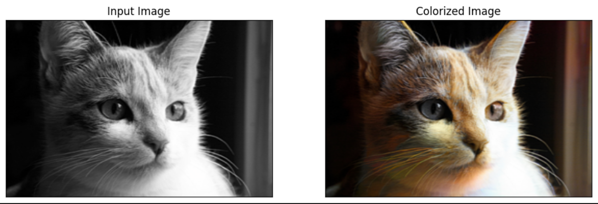
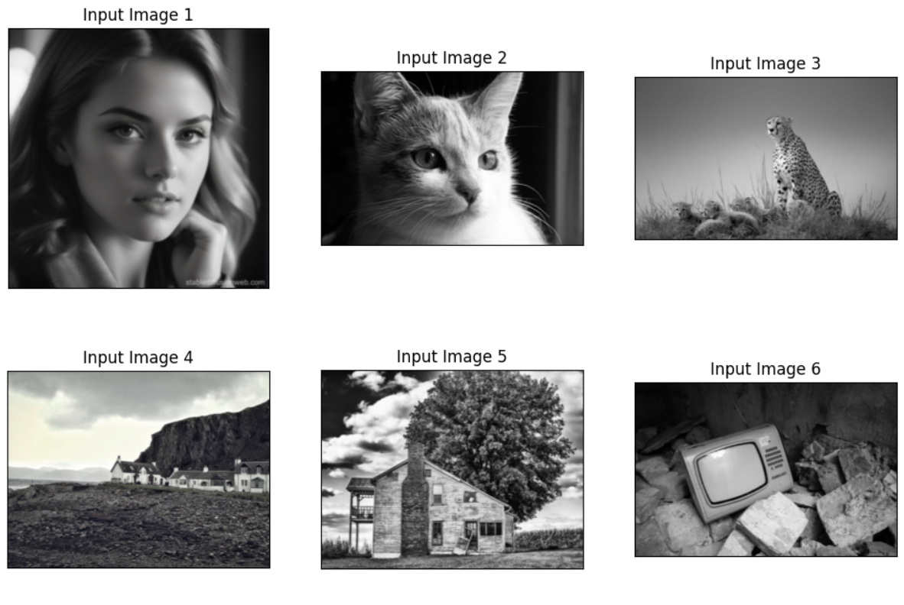
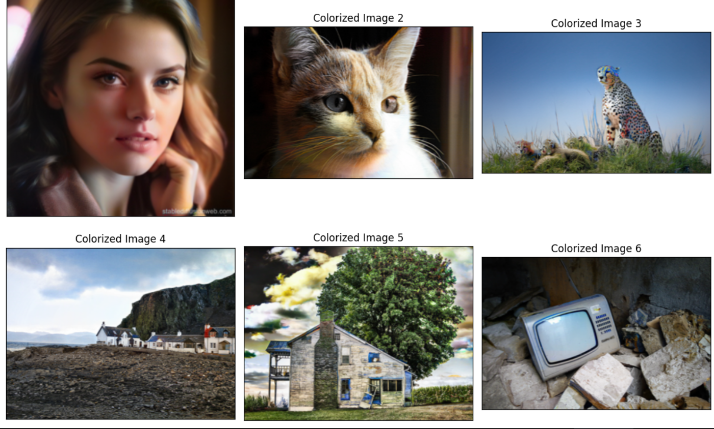

# Image Colorization

Deep learning models for grayscale-to-color image translation

## Problem

- Colorizing gray-scaled images is a challenging task because a single gray value can correspond to multiple possible color
- Color values must be realistic and reasonable

## Solution

- Design a Resnet-18 encoder - Unet decoder architectures to preserve spatial information
- Applies GAN-based models to generate more realistic and vivid colors

## Tech
- Python
- PyTorch
- Resnet, U-net, GAN

## Result

  <b>Before</b> 
    
  <b>After</b> 
  

